# HutDeals 套餐散文解析規則路線圖（parse-rules）

> **維護規矩**：改 `script/scan/parse_meal.py` 前先讀本文件；新增/修改規則後**必回寫本文件**
> （規則表狀態、覆蓋率、待攻克清單）。規則是「句式類」級——禁止針對單一券號補丁。
> 測試守護：`script/support/tests/test_parse_meal_items.py`（每個 case = 一個句式類）。

## 流程總覽

```mermaid
flowchart LR
    RAW[og:description / desc_head] --> L0["L0 strip_meta<br>前綴/價格短語/尾註 規則表"]
    L0 --> L1["L1 split_main<br>＋/買/送<量詞>/升級 切主項"]
    L1 --> L2["L2 parse_segment<br>R0-R6 段內規則表"]
    L2 --> L3["L3 verify<br>殘渣檢查"]
    L3 -->|通過| ITEMS[items&#91;&#93; anchor+choices]
    L3 -->|多句條款| NONE[None → 前端顯示原文]
```

輸出 schema（不變）：`{text, choices[], add}`；所有 or-chain **統一 anchor 形**
（首項為 anchor、其餘為 choices、N選M 註記正規化到 anchor 尾）——前端 `MealItems`
據此歸類 **披薩口味組／副餐／飲料／單獨品項**（使用者拍板的展示分類）。

## L0 清洗規則表

| 規則 | 句式類 | 例 | 狀態 |
|---|---|---|---|
| 碼前綴 | `NNNNN-` | `93020-外帶買大比薩` | ✅ |
| 通路前綴 | 外帶/外送（全形斜線/連寫/單寫） | `外送/外帶 1個9吋…` | ✅ |
| 「套餐內容：」前綴 | | `套餐內容：經典系列…` | ✅ |
| P1 價值註記 | `(最高價值$N)`/`(原價NT$N元)`/`{最高價值$N}`/`(最多現省$N)`/`(現省$N)` | 16010/26976/16012 | ✅ |
| P5 此套餐合計 | `此套餐合計$N元` | 26979 | ✅ |
| P2 帶價短語 | `=特價NT$N元`/`-特價$N`/`=NT$N`（**只刪短語,不斷後文**） | 16282/16020/16011 | ✅ v2 修 |
| P3 起價短語 | `($N元起)`/`特價$N起！`/`$N起` | 16012/93022/91112 | ✅ v2 修 |
| * 注意事項 | ` *外送服務…`（`*數字`=乘號,**保留**） | 26975 / 91111 | ✅ v2 修 |
| 樣板尾註 | `實際供應以門市為準…`/`(因比[薩蕯]餅皮…`/`外送服務為限區服務…` | 全域 | ✅ |
| 條件加價註記 | `(若小比薩選擇 $410(含)以上需另外加價)` | 93020/93021 | ✅ |

**v2 關鍵教訓**：價格段可能出現在**句中**（`…或彩蔬鮮菇=特價$368(最高價值$1210) +1個9吋…`）。
舊版 `_PRICE_CUT` 從價格處切斷到尾 → 後面主項整段消失（16011 第二個比薩失蹤的根因）。
v2 一律「刪短語、留後文」。

## L1 主項切分規則表

| 規則 | 句式類 | 例 | 狀態 |
|---|---|---|---|
| `＋/＋` | 最常見 | `比薩+薯金幣+可樂` | ✅ |
| 空格 `買/再加/升級` | 買送對句 | `…嫩雞 送1個13吋…` | ✅ |
| 無空格 `送<量詞數字>` | `)送1個`/`幣送2個` | 16020/93020 | ✅ v2 修 |
| 買一送一/買大送小 **不切** | `買(?!一|大)` 負向集 | 92117/93021 | ✅ v2 修 |
| 加購併回 | `+NN元即享/帶回家` | 26979 | ✅ |

守衛：`外送服務…`（送後非量詞）、`買1送1`（送前有數字）不誤切。

## L2 段內解析規則表（優先序 R0→R6）

| 規則 | 句式類 | 例 | 狀態 |
|---|---|---|---|
| R0 加價購 | `[$N] +NN元即享…` | 26979 | ✅ |
| R1 口味前綴 | `(口味任選N個)/(口味任N個)/(口味N選M個)`＋**冒號可省** | 16020(無冒號)/16058(任1個)/16049 | ✅ v2 擴 |
| R1b 泛用括號N選M＋冒號 | `(4選1):A或B…` | 16010/16059 | ✅ v2 新 |
| R4 內聯 | `(A或B或C-以上口味N選M)` | 26880 Flatzz | ✅ |
| R3 dash | `經典口味-A、B、C等任選` | 94199/94299/93010 | ✅ |
| R5 或-chain | `或`/`／`/`/`（**括號深度感知**）→ 統一 anchor 形；段尾`(副食N選M)`正規化`(N選M)` | 16013/26701/94601 | ✅ v2 重構 |
| R6 純項 | 其餘 | 92001 | ✅ |

註記來源優先序：段尾 `(N選M)` > `{N選M}`（先正規化）> `(擇一)`。

## L3 驗收

- 殘渣標記：任一 item text 含 `；` 或 `補差價`（多句條款散文）→ 整體回 `None`（93015 類）。
- 前端對 `None`/`[]` fallback 顯示原文（誠實原則）。

## 覆蓋率現狀（2026-09-06 v2）

| 語料 | grouped(有選項組) | flat(純項) | none(fallback) |
|---|---|---|---|
| 官方 corpus 30 | 13 | 16 | 1（93015 多句條款） |
| 外部碼 40（有 desc） | 22 | 17 | 1（同上,重複集） |

v1 對照：16010/16011/16012/16013/16014/16020/16282 等外部碼全數 flat/錯誤黏黏 → v2 全部 grouped。

## 待攻克（已知未覆蓋句式）

1. **93015 多句變價券**（`$565～$790 補差價`）——需「區間價」語意模型，先 fallback。
2. **混合 or-chain 的分類精度**：`可樂或薯金幣或QQ球(4選1)` 混合飲料+副食 → 前端歸「副餐」
   （可接受）；若要更準，items schema 需加 `cat` 欄位（跨前端改動,另開票）。
3. **91114 `義大利麵/燉飯 L經典套餐x1`**：`/` 是同品異名非選項組，anchor 形略失真（可接受）。
4. **og:description 與 step_2 頁文不一致**：enrich_official 以 coupons.js description 為真值
   （step_2 og:description 有缺字,94199 實測）。

## 維護 SOP

1. 發現新句式 → 從 corpus 聚類確認是「類」不是個案
2. 加/擴 L0-L2 規則表條目 + `test_parse_meal_items.py` 加 case（fixture 用真實 desc）
3. `python -m unittest discover -s script/support/tests` 全過
4. 跑覆蓋率腳本（官方 corpus + scan_state 有 desc 集）確認無退化
5. 回寫本文件（規則表狀態/覆蓋率/待攻克）
6. 重 parse 資料：一次性工具 `script/support/tools/refresh_meal_parse.py`
   （refresh scan_state → ingest_external 重建 coupons.js）
