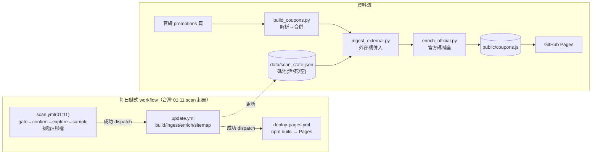
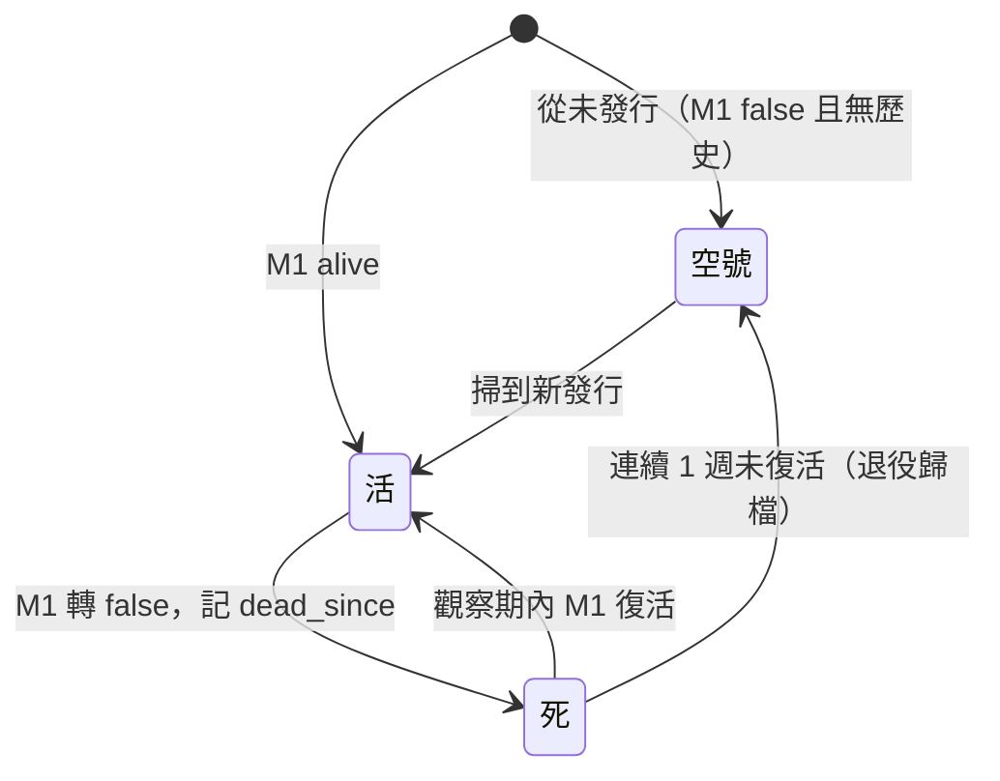

# HutDeals 工作流總覽（data pipeline）

> 本檔是**流程圖與現狀的權威文件**（與 `code-structure.md` 同級）；動線改動時同步更新。
> 更新：2026-09-08（orderflow items、分類 cat、公開版）。

## 1. 全域資料流

## 2. 碼狀態機（三態）

## 3. 各 CI / 腳本職責（鏈式，2026-09-08）

| 觸發 | 腳本 | 職責 |
|---|---|---|
| 每日 01:11（scan.yml cron 起頭） | `scan.daily confirm`（gate job 先檢查無 open 失敗 issue） | 現有碼死活＋內容更動確認；死碼 dead_since 滿 7 天→空號 |
| 〃 串行 | `scan.daily explore` | 16/26 號段 M1 普查，新活碼自動入庫 |
| 〃 串行 | `scan.daily sample` | 潛在未知號段抽樣（2026-09-08 起減半；命中→admin 警告） |
| scan 成功 dispatch | `site.build_coupons`（update.yml） | 官網列表 → coupons.js 本體 |
| 〃 | `site.ingest_external` | scan_state 活碼 → coupons.js（外部碼） |
| 〃 | `site.enrich_official` | 官方碼 step_2 補全（只補缺不覆蓋） |
| 〃 | `site.gen_sitemap` | 產 sitemap.xml（主站+券深連結） |
| update 成功 dispatch | `deploy-pages.yml` | npm build → GitHub Pages（push 亦觸發） |

> 失敗處理：任一步失敗 → 開 `scan-failed`/`scrape-failed` issue → 隔日 gate 見 open issue 即禁掃（防污染）。
> update/deploy 無固定 cron，完全依賴 scan 成功 dispatch（或手動 workflow_dispatch）。

## 4. 禮節節奏

掃號對官網驗證端點請求遵守節奏（`lib/pacing`）：sleep + 隨機浮動、每 N 發中場休息、
換號段休息。熔斷：429/403 立即停、傳輸失敗記 unknown 不算死。

## 5. items 來源（orderflow）

券內容 items 用**訂餐流程選單版結構化爬取**（取代文字 parse_meal，退役至 `archive/parse/`）：
- `lib/orderflow.py`：4 步 session 流程（配 cookie → 取 llcs → step_1 選門市 → 重抓選單版），
  `BatchFetcher` K 張共用 session。
- `scan/parse_orderflow.py` + `extract_js.cjs`：選單版內嵌 JS 變數（psidss/pprcss/ctidss）→
  結構化候選 items（含組分類 cat）。
- 新 items schema：`{text, group, groupIdx, priceAdd, flavors[], cat}`（見 `docs/items-schema.md`）。

## 6. 價格與 desc 原則（2026-09-07）

- 結構化欄位一律從結構化 HTML（descPrice/套餐價格/price_selling/組標題），desc 只當備用。
- 起價券（無結構化固定價）以 desc「$N 起」兜底，`priceNote="起"` 標記（見 `docs/crawler-data-sources.md`）。
